# 🚀 Automated ITIL Project

## 📌 Overview

This project is a **Python-based Automated ITIL Service Desk system** developed to automate manual helpdesk operations using **ITIL concepts**.

It replaces traditional support methods (calls, emails, chats) with an automated backend system that handles:

* Ticket management
* Incident handling
* SLA tracking
* Monitoring alerts – Real-time system monitoring (CPU, RAM, Disk, Network)
* Reporting and analytics

---

## 🚀 Key Features

### 🎫 Ticket Management

* Create Ticket
* View All Tickets
* Search Ticket by ID
* Update Ticket Status
* Close Ticket
* Delete Ticket

---

## ⚙️ ITIL Modules

### Incident Management

Handles system failures such as:

* Server down
* Internet issues
* Application crashes

---

### 🛎 Service Request Management

Handles user requests such as:

* Password reset
* Software installation

---

### 📊 Problem Management

* Detects repeated issues (≥ 5 times)
* Automatically creates **Problem Record**
* Stored in `problems.json`

---

### 🔄 Change Management

* Create change requests
* Stored in `changes.json`

---

## ⏱ SLA Management

| Priority | SLA      |
| -------- | -------- |
| P1       | 1 Hour   |
| P2       | 4 Hours  |
| P3       | 8 Hours  |
| P4       | 24 Hours |

System capabilities:

* Tracks pending tickets
* Detects SLA breaches
* Escalates unresolved issues
* Generates alerts

---

## 🖥 System Monitoring

Monitors:

* CPU Usage
* Memory Usage
* Disk Usage
* Network Usage

If thresholds exceed:

* Auto ticket is created
* Priority set to **P1**
* Logged as **CRITICAL**

---

## 📊 Reports

### 📅 Daily Report

* Total Tickets
* Open Tickets
* Closed Tickets
* High Priority Tickets
* SLA Breaches

---

### 📈 Monthly Report

* Most common issue
* Average resolution time
* Top department
* Total tickets
* Repeated problems

---

## 📝 Logging

Logs stored in `logs.txt` with levels:

* INFO
* WARNING
* ERROR
* CRITICAL

Tracks:

* Ticket creation
* Updates
* Closures
* Monitoring alerts
* SLA breaches
* Errors

---

## 💾 Data Storage

* `tickets.json` → Ticket data
* `logs.txt` → Logs
* `backup.csv` → Backup
* `problems.json` → Problem records
* `changes.json` → Change requests

---

## Python Concepts Used

### Core Python

* Variables, Data Types
* Input / Output
* Conditions & Loops
* Functions
* String Handling

### Intermediate Python

* Lists, Tuples, Sets, Dictionaries
* File Handling (JSON, CSV)
* Modules & Packages
* Context Managers

### OOP Concepts

* Classes & Objects
* Inheritance
* Encapsulation
* Polymorphism
* Static Methods

### Advanced Python

* Decorators
* Generators
* Iterators
* map / filter / reduce
* Regex Validation

---

## 🧪 Testing

Test cases implemented for:

* Ticket creation
* Priority logic
* SLA breach
* Auto monitoring ticket creation
* File read/write
* Search ticket
* Exception handling

### ▶ Run Tests

```bash
python test_cases.py
```

---

## 🏗 System Flow

User Input
→ Ticket Creation
→ Save to JSON
→ SLA Check
→ Monitoring
→ Auto Ticket Creation
→ Problem Detection
→ Reporting

---

## Sample Output

```
Ticket Created: T0001
⚠ Similar issue detected (used for problem tracking)
🔥 PROBLEM RECORD CREATED: T0006 (server down)
🚨 Auto Ticket Created: T0007 (High CPU Usage)
```

---

## 🛠 Technologies Used

* Python
* JSON
* CSV
* psutil

---

## ▶️ How to Run

```bash
pip install -r requirements.txt
python main.py
```

---

## 🐞 Debugging

* Breakpoints used
* Variables inspected
* Call stack analyzed
* Step-by-step execution

---

## 📂 Project Structure

```
Automated_ITIL_Project/
│── main.py
│── tickets.py
│── monitor.py
│── reports.py
│── itil.py
│── utils.py
│── logger.py
│── test_cases.py
│── requirements.txt
│── README.md
│── data/
│   ├── tickets.json
│   ├── logs.txt
│   ├── backup.csv
│   ├── problems.json
│   └── changes.json
│── screenshots/
```

---

## 📸 Screenshots

### 🎫 Create Ticket

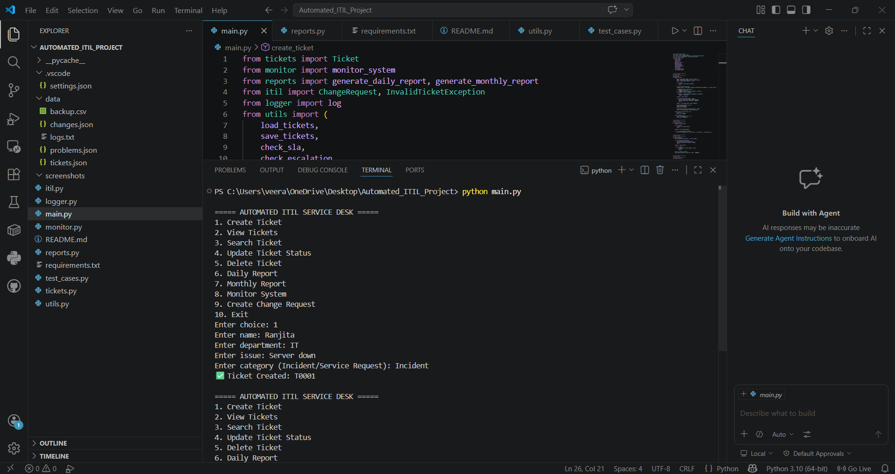

### 📋 View Tickets

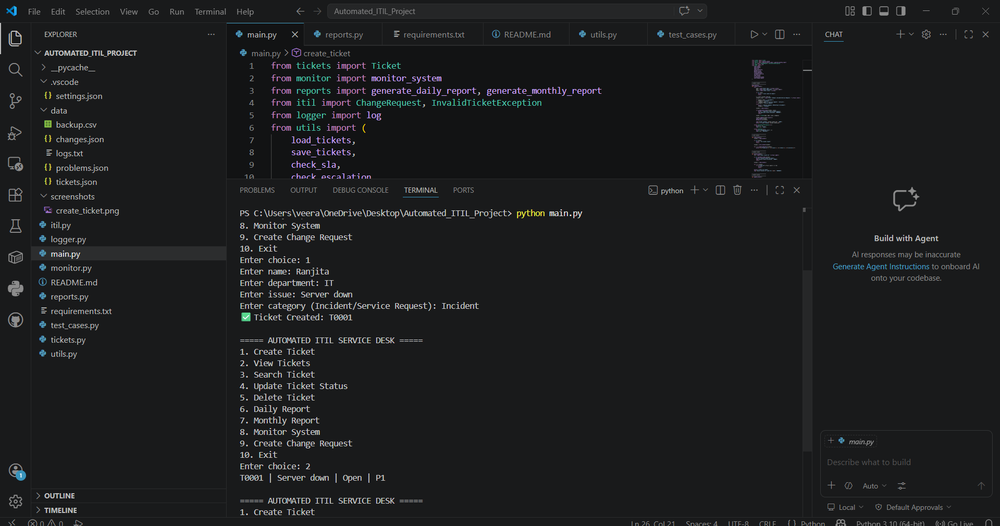

### 🔍 Search Ticket

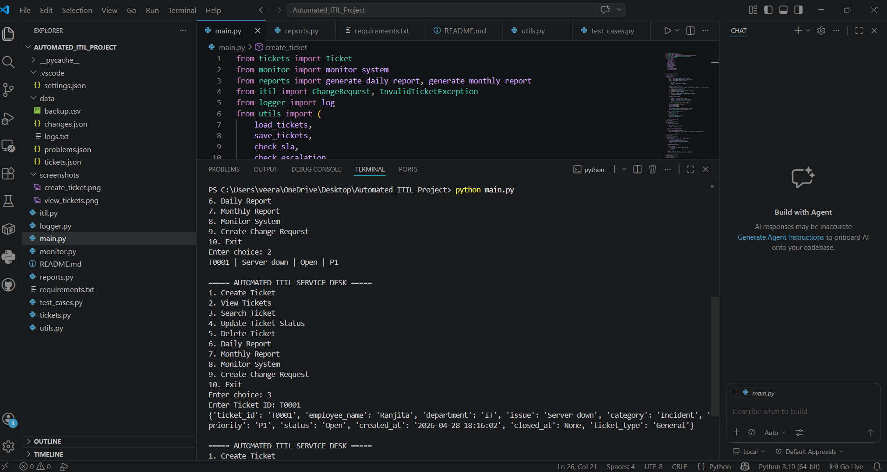

### 🔄 Update Ticket

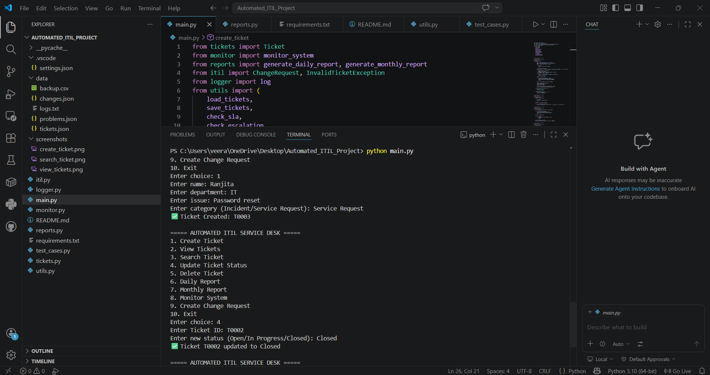

### ⏱ SLA Breach

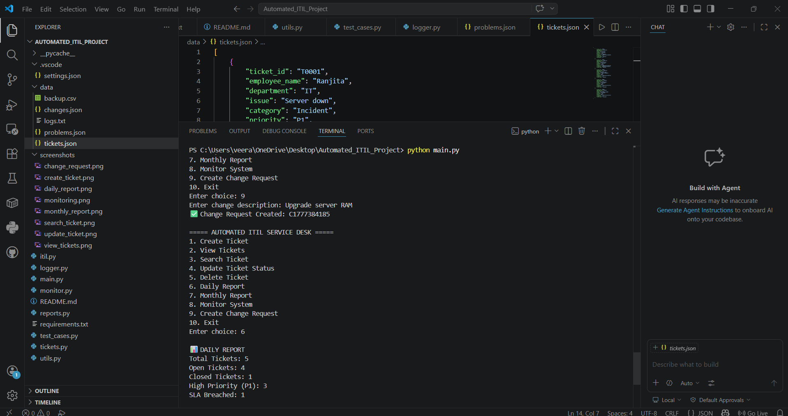

### 🖥 Monitoring

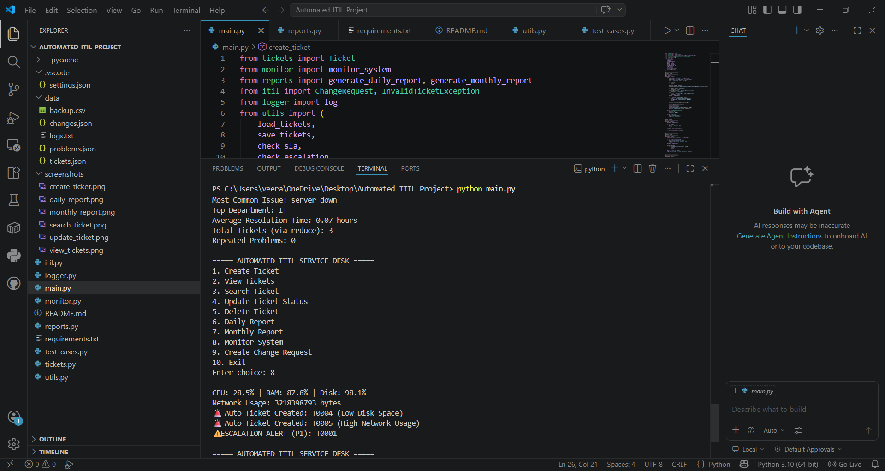

### 📊 Daily Report

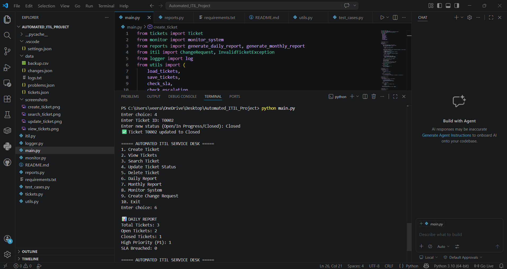

### 📈 Monthly Report

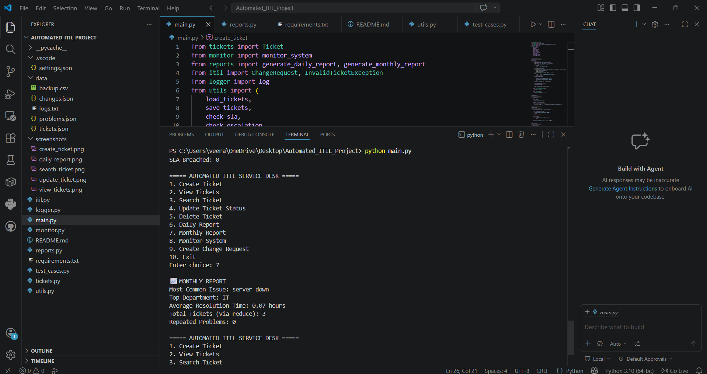

### 🔄 Change Request

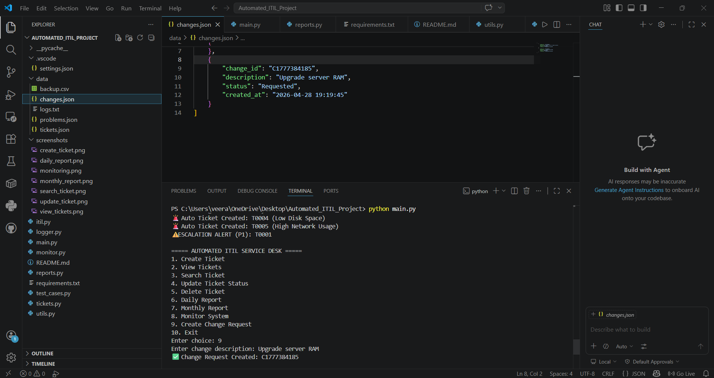

### 🔥 Problem Record

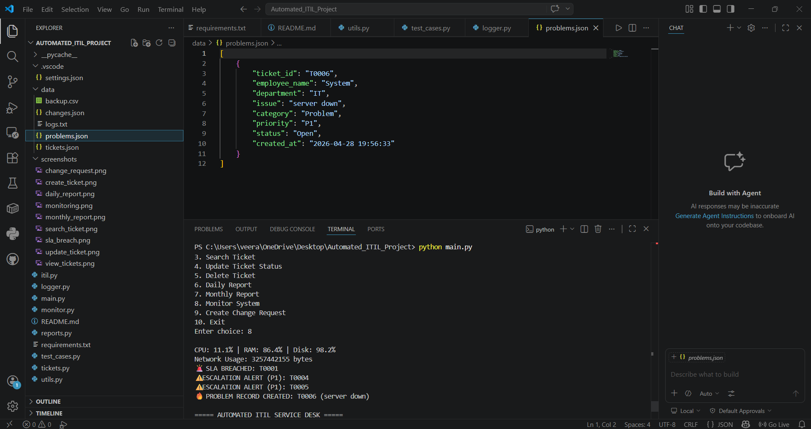

### 🐞 Debugging

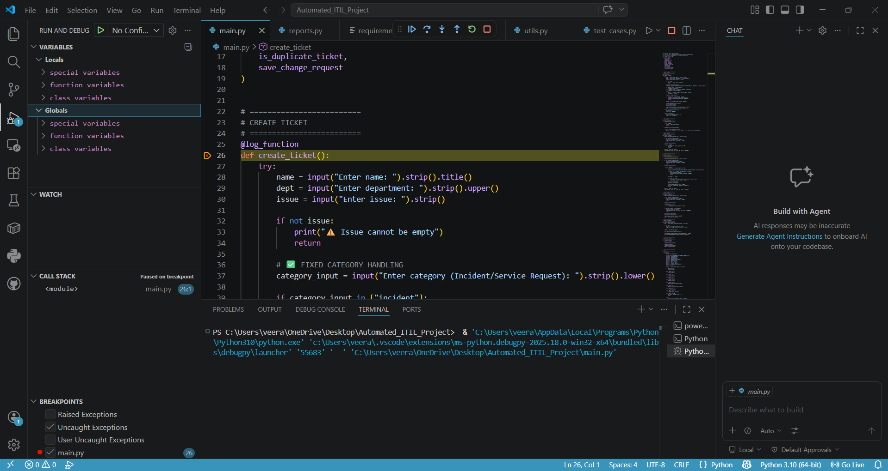

---

## 👩‍💻 Author

Ranjita

---

## ✅ Conclusion

This project demonstrates:

* Core Python Programming
* OOP Concepts
* File Handling & Data Persistence
* ITIL Workflow Implementation
* Automation of IT Service Desk

👉 A scalable backend IT service automation system based on real-world ITIL practices.
